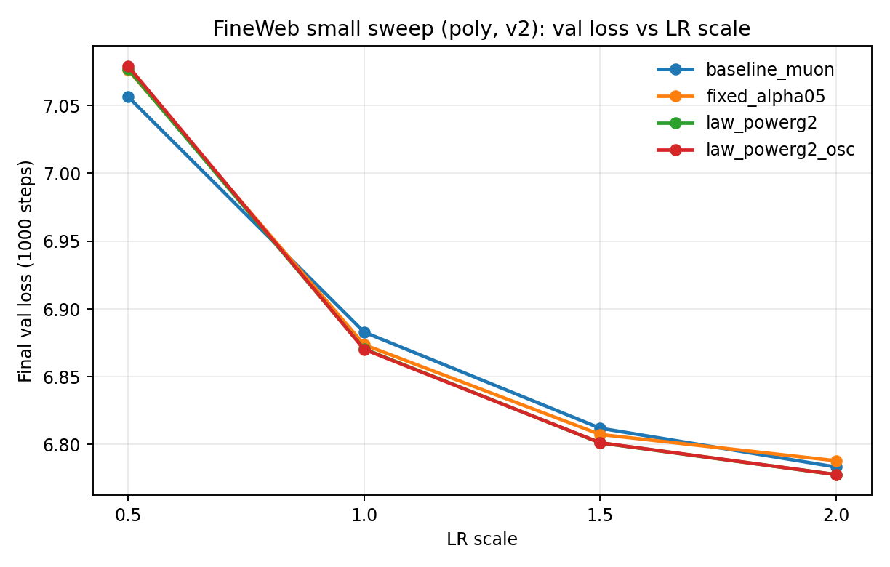
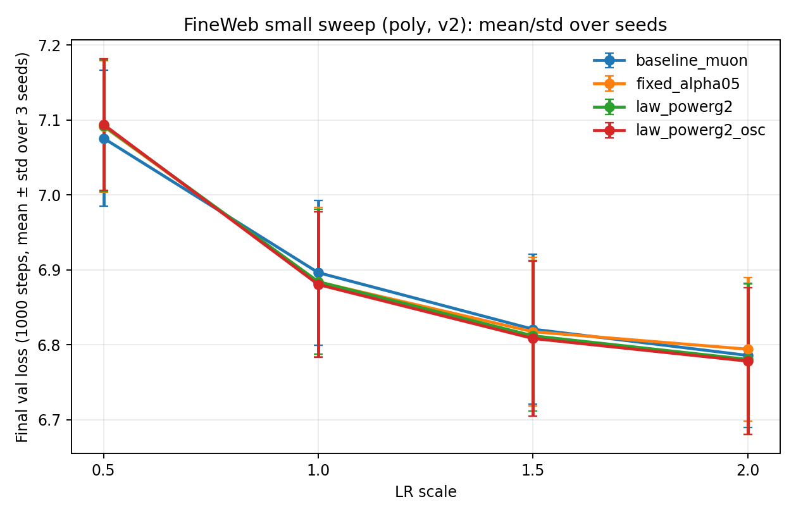

# Muon Schedule Lab

A clean experimental repo combining:

- [`Muongpt`](https://github.com/tomoqt/Muongpt) as the GPT training base
- scheduled singular-value power transforms from the `scheduled-muon` experiments

The core idea is to control update geometry with a singular-value exponent `p`.
Lower `p` is treated as more exploratory behavior. Higher `p` is treated as more exploitative behavior.

## Math in one place
Let a matrix update be `G = U S V^T`.

- Standard SGD keeps `p=1`: `G = U S^1 V^T`.
- Muon-like zeroth-power behavior corresponds to `p=0`: `U S^0 V^T`.
- General family: `G_p = U S^p V^T`.

Equivalent alpha form:

`G_alpha = G (G^T G)^(-alpha) = U S^(1-2alpha) V^T`, so `p = 1 - 2alpha`.

## What is implemented
Muon parameter groups can now run either:

- Newton-Schulz Muon update (original behavior), or
- singular-value-power update with scheduled exponent `p`.

For power updates, backend behavior is:

- `power_backend=poly` (default): polynomial approximation
- `power_backend=exact`: exact SVD (only when explicitly requested)

Supported schedules:

- `anneal`: linear annealing from `p_start` to `p_end`
- `anneal_cosine`: cosine annealing from `p_start` to `p_end`
- `fixed_alternating`: alternate between `p_low` and `p_high` every `power_alternation_period` steps
- `entropy_alternating`: switch between `p_low` and `p_high` using two entropy thresholds

Entropy-alternating uses gradient-matrix SVD entropy in `[0,1]`:

- switch to `p_high` when entropy rises above `power_entropy_high`
- switch to `p_low` when entropy falls below `power_entropy_low`

## Key files
- `train.py`: training loop and schedule integration
- `muon.py`: optimizer internals with optional power-SVD update
- `power_schedule.py`: schedule classes + entropy utilities
- `scripts/schedule_smoke.py`: small local smoke test on random data
- `scripts/run_schedule_suite.py`: reproducible baseline-vs-schedule suite runner

## Install
```bash
pip install -r requirements.txt
```

## Local smoke test (small)
This verifies all three schedule classes and optimizer integration without dataset prep:

```bash
python scripts/schedule_smoke.py
```

## Dataset prep (for real training)
Example small dataset:

```bash
python data/shakespeare_char/prepare.py
```

## Run training with schedules
Single-process example with Muon + annealing schedule:

```bash
python train.py \
  --dataset=shakespeare_char \
  --use_muon=True \
  --enable_power_schedules=True \
  --power_backend=poly \
  --power_schedule_type=anneal \
  --power_p_start=1.0 \
  --power_p_end=0.0 \
  --max_iters=200 \
  --batch_size=16 \
  --block_size=128 \
  --compile=False
```

Fixed alternating example:

```bash
python train.py \
  --dataset=shakespeare_char \
  --use_muon=True \
  --enable_power_schedules=True \
  --power_backend=poly \
  --power_schedule_type=fixed_alternating \
  --power_p_low=0.0 \
  --power_p_high=1.0 \
  --power_alternation_period=50 \
  --max_iters=200 \
  --batch_size=16 \
  --block_size=128 \
  --compile=False
```

Entropy alternating example:

```bash
python train.py \
  --dataset=shakespeare_char \
  --use_muon=True \
  --enable_power_schedules=True \
  --power_backend=poly \
  --power_schedule_type=entropy_alternating \
  --power_p_low=0.0 \
  --power_p_high=1.0 \
  --power_entropy_low=0.45 \
  --power_entropy_high=0.65 \
  --max_iters=200 \
  --batch_size=16 \
  --block_size=128 \
  --compile=False
```

Exact SVD is opt-in:

```bash
python train.py \
  --use_muon=True \
  --enable_power_schedules=True \
  --power_backend=exact
```

## Keep baseline in every comparison
Use the suite runner to always run baseline plus schedule variants under matched settings:

```bash
uv run --with-requirements requirements.txt \
  python scripts/run_schedule_suite.py \
  --max-iters 500 \
  --name-prefix long500
```

## Findings on shakespeare_char
Unless noted otherwise, all values are from 2000-step runs with
`config/train_shakespeare_char.py`, `n_layer=2`, `n_head=2`, `n_embd=64`.
The reference baseline run is:
- `long2000_baseline_muon`: `val=1.9162`, `train=1.7794`

### Fixed alpha runs (single constant `p`)
What we changed: we kept one fixed `alpha` for the whole run, so `p=1-2alpha` is constant.
This is the cleanest check of whether a single power beats baseline Muon.

Coarse run set over `alpha in {-0.5, 0, 0.25, 0.5, 0.75, 1.0}`:
- Best was `alpha=0.5` (`p=0`), `val=1.9861`
- Moving far from `alpha=0.5` quickly degrades quality

Refined run set below `0.5` (`alpha in {0.49, 0.48, 0.45, 0.40, 0.35, 0.30}`):
- Best was `alpha=0.49` (`p=0.02`), `val=2.0036`
- This stayed worse than the `alpha=0.5` run (`1.9861`)


### Entropy threshold-switch runs
What we changed: instead of one fixed `p`, we switched between `p_low` and `p_high`
based on entropy crossing two thresholds (classic hysteresis). This lets `p` move only
when entropy clearly moves up or down.

Initial runs with wide `p_high` were unstable and high-loss.
Follow-up runs with smaller `p_high` found:
- Best: `p_low=0.0`, `p_high=0.04`, thresholds `0.695/0.715`, `val=2.0063`
- Increasing `p_high` above `0.04` worsened validation in this setting


### Entropy-law runs (`p` set by a formula)
What we changed: instead of hard switching, we computed `p` from current entropy with
linear, power, or sigmoid mappings.

Across linear / power / sigmoid mappings with `p in [0, 0.12]`, best run was:
- `power` law with `gamma=2`: `val=1.9990`

Wider-range runs confirmed:
- Very large `p_high` values (for example `0.5`) and some inverse mappings hurt quality


### Repeatability check (3 seeds)
What we changed: we reran the best few scheduled variants with seeds `{1337,1338,1339}`
to test if ranking was stable.

Mean and std over seeds `{1337,1338,1339}`:

| method | mean val | std |
|---|---:|---:|
| fixed_alpha05 | **1.9645** | 0.0154 |
| hyst_p004 | 1.9810 | 0.0203 |
| law_powerg2 | 1.9844 | 0.0200 |
| law_powerg2_osc | 1.9975 | 0.0114 |


### Exact backend (`power_backend=exact`)
What we changed: scheduled methods used exact SVD for the power update.

| method | LRx0.5 | LRx1.0 | LRx1.5 | LRx2.0 | best |
|---|---:|---:|---:|---:|---:|
| baseline_muon | 1.9348 | **1.9162** | 1.9432 | 1.9630 | **1.9162 @1.0** |
| fixed_alpha05 | 2.0367 | 1.9861 | **1.9526** | 1.9677 | **1.9526 @1.5** |
| law_powerg2 | 2.0421 | 1.9990 | **1.9698** | 1.9822 | **1.9698 @1.5** |
| law_powerg2_osc | 2.0521 | 2.0040 | 2.0072 | **1.9796** | **1.9796 @2.0** |


### Poly backend (`power_backend=poly`, default)
What we changed: scheduled methods used the polynomial approximation instead of exact SVD.

| method | LRx0.5 | LRx1.0 | LRx1.5 | LRx2.0 | best |
|---|---:|---:|---:|---:|---:|
| baseline_muon | 1.9348 | **1.9162** | 1.9432 | 1.9630 | **1.9162 @1.0** |
| fixed_alpha05 | 2.1221 | 2.0577 | **2.0342** | 2.0494 | **2.0342 @1.5** |
| law_powerg2 | 2.1221 | 2.0534 | **2.0250** | 2.0467 | **2.0250 @1.5** |
| law_powerg2_osc | 2.1345 | 2.0637 | **2.0381** | 2.0491 | **2.0381 @1.5** |


### Practical read
Baseline Muon is still best across all LR scales in this setup.
Poly backend is faster than exact for scheduled runs, but currently loses validation quality
relative to exact by roughly `+0.06` to `+0.08` val loss on average across the tested methods.
Across the full set of char experiments, none of the scheduled variants beat baseline Muon on final validation.

### Other char experiments (full audit)
An audit of local `wandb` logs found `104` `shakespeare_char` runs:
`9` short bring-up runs (`16-24` steps), `3` runs at `300` steps,
`4` runs at `500` steps, and `88` runs configured for `2000` steps.
One of the `2000`-step runs stopped early at step `900`.

#### Bring-up runs (`16-24` steps, exact backend)
What we changed: very short runs to confirm schedule logic and logging were wired correctly.
These are sanity checks, not quality benchmarks.

| run | final iter | val | train |
|---|---:|---:|---:|
| baseline_muon_small | 20 | **4.1738** | 4.1731 |
| entropy_alt_p0_p1_small | 20 | 4.1753 | 4.1745 |
| fixed_alt_p0_p1_small | 20 | 4.1793 | 4.1784 |
| fixed_alt_p0_p1_period8_small_v2 | 24 | 4.1807 | 4.1794 |
| anneal_p0_to_p1_small | 20 | 4.1817 | 4.1807 |
| fixed_alt_p0_p1_period4_small_v2 | 24 | 4.1833 | 4.1818 |
| entropy_alt_p0_p1_tight_thresholds_small_v2 | 24 | 4.1841 | 4.1826 |
| fixed_alt_p0_p1_period1_small | 16 | 4.1878 | 4.1838 |
| fixed_alt_p0_p1_period4_small | 16 | 4.1883 | 4.1843 |

#### Intermediate runs (`300/500` steps, exact backend)
What we changed: longer early-stage runs to see if alternating schedules showed quick gains.
At this horizon, alternating schedules were clearly behind baseline.

| run | final iter | val | train |
|---|---:|---:|---:|
| fixed_alt_period60_long300 | 300 | **3.3605** | 3.3490 |
| fixed_alt_period20_long300 | 300 | 3.3614 | 3.3499 |
| entropy_alt_long300 | 300 | 3.3864 | 3.3791 |
| baseline_muon_long500 | 500 | **2.3503** | 2.3042 |
| entropy_alt_long500 | 500 | 2.9257 | 2.9019 |
| fixed_alt_period20_long500 | 500 | 2.9352 | 2.9063 |
| fixed_alt_period60_long500 | 500 | 2.9372 | 2.9116 |

#### Direct alternating schedules at `2000` steps (exact backend)
What we changed: explicit side-by-side runs with fixed `p=0` and simple alternating schedules,
separate from the formula-based entropy-law runs.

| run | final iter | val | train |
|---|---:|---:|---:|
| long2000_baseline_muon | 2000 | **1.9162** | 1.7794 |
| long2000_alpha05_p0_constant | 2000 | 1.9861 | 1.8665 |
| long2000_fixed_alt_p01_period60 | 2000 | 2.0582 | 1.9734 |
| long2000_fixed_alt_p01_period20 | 2000 | 2.0858 | 2.0111 |
| long2000_entropy_alt_p01 | 2000 | 2.2687 | 2.2431 |

#### Partial run
`long2000_entropy_law_wide_linear_c1_ph0p12_e0p55_0p75` was configured for `2000` steps
but stopped at step `900` with `val=2.2048`. It is excluded from final comparisons.

## Findings on fineweb (small local)
These runs use `config/train_fineweb_small.py` with
`max_iters=1000`, `batch_size=4`, `block_size=256`,
`n_layer=4`, `n_head=4`, `n_embd=256`, `device=mps`, `dtype=float32`, `seed in {1337,1338,1339}`.
All FineWeb runs below use `power_backend=poly` (default) with quintic polynomial settings.

### Run inventory and validity
From local `wandb` logs there are `54` FineWeb runs:

| group | count | status | note |
|---|---:|---|---|
| pilot baseline | 1 | completed | `fineweb_pilot_baseline_muon_small` (`200` steps) |
| entropy fallback check | 1 | completed | `fineweb_entropy_fix_check` (`120` steps) |
| initial sweep (`fineweb_small_lr_sweep_poly_*`) | 4 | mixed | law runs were pre-fix and one run was interrupted at step `900` |
| corrected sweep (`fineweb_small_lr_sweep_poly_v2_*`) | 48 | completed | `4` methods x `4` LR scales x `3` seeds |

In the pre-fix law runs, logs show `p 0.0000` throughout and no entropy field, so those
results are not treated as valid schedule behavior.

### FineWeb LR sweep (`v2`, seed 1337 snapshot)
What we changed: matched runs for 4 methods and 4 LR scales, then looked at final val loss
after `1000` steps.

LR scales are `{0.5, 1.0, 1.5, 2.0}` over base
`learning_rate=1e-4`, `muon_lr=1e-2`, `min_lr=1e-5`.

| method | LRx0.5 | LRx1.0 | LRx1.5 | LRx2.0 | best |
|---|---:|---:|---:|---:|---:|
| baseline_muon | 7.0563 | 6.8828 | 6.8119 | 6.7832 | **6.7832 @2.0** |
| fixed_alpha05 | 7.0762 | 6.8734 | 6.8072 | 6.7878 | **6.7878 @2.0** |
| law_powerg2 | 7.0768 | 6.8704 | 6.8010 | 6.7776 | **6.7776 @2.0** |
| law_powerg2_osc | 7.0790 | 6.8700 | 6.8011 | 6.7776 | **6.7776 @2.0** |



### FineWeb LR sweep (`v2`, mean ± std over 3 seeds)
What we changed: repeated the same 16-run matrix for seeds `1338` and `1339`, then computed
mean and standard deviation across the three seeds.

| method | LRx0.5 | LRx1.0 | LRx1.5 | LRx2.0 | best mean |
|---|---:|---:|---:|---:|---:|
| baseline_muon | 7.0757 ± 0.0908 | 6.8963 ± 0.0967 | 6.8208 ± 0.1002 | 6.7858 ± 0.0960 | **6.7858 @2.0** |
| fixed_alpha05 | 7.0915 ± 0.0877 | 6.8838 ± 0.0994 | 6.8174 ± 0.0991 | 6.7941 ± 0.0959 | **6.7941 @2.0** |
| law_powerg2 | 7.0925 ± 0.0878 | 6.8841 ± 0.0965 | 6.8119 ± 0.1002 | 6.7805 ± 0.1004 | **6.7805 @2.0** |
| law_powerg2_osc | 7.0940 ± 0.0877 | 6.8804 ± 0.0967 | 6.8084 ± 0.1036 | 6.7781 ± 0.0980 | **6.7781 @2.0** |



### Practical read (FineWeb, updated)
At `LRx0.5`, baseline Muon remains best.
At `LRx1.0` to `LRx2.0`, entropy-law variants remain slightly better on mean validation
(`~0.008` to `0.016` better than baseline, depending on LR), but seed-to-seed spread is
much larger (`~0.09` to `0.10` std), so this is still weak evidence.
Across runs, schedules stay near low `p` most of the time, so behavior remains close to
the fixed-`p=0` behavior.

## Notes
- Power schedule runs default to polynomial updates unless you set `power_backend=exact`.
- Entropy-based switching is intentionally simple and intended as an experimental baseline.
- This repo is meant to make schedule ablations easy to run and compare.
