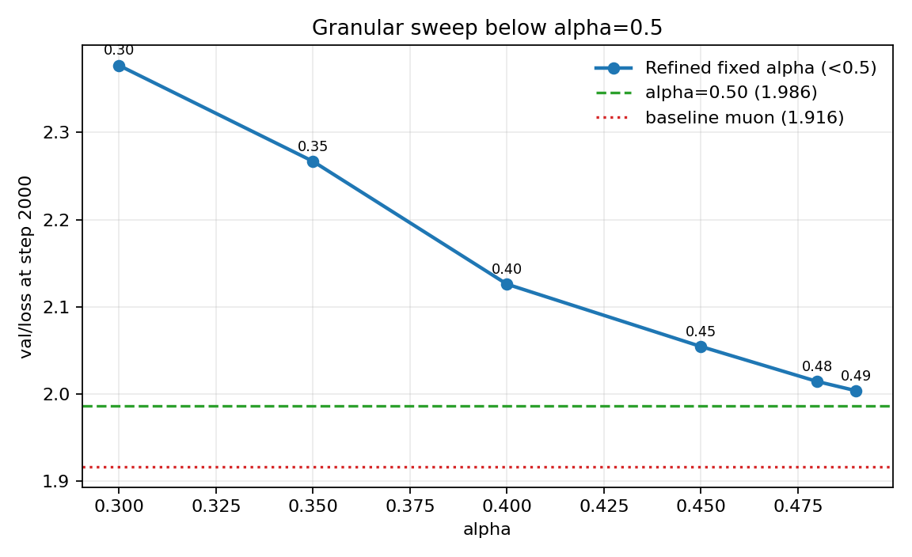
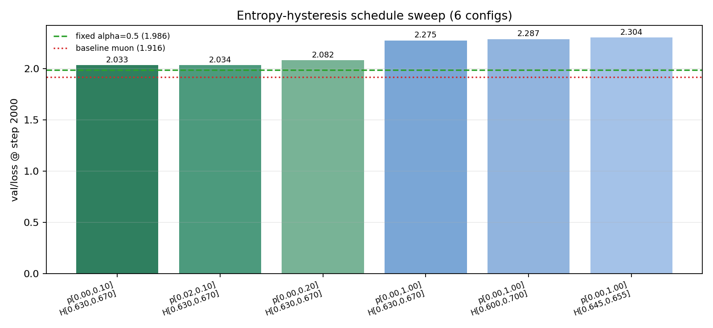
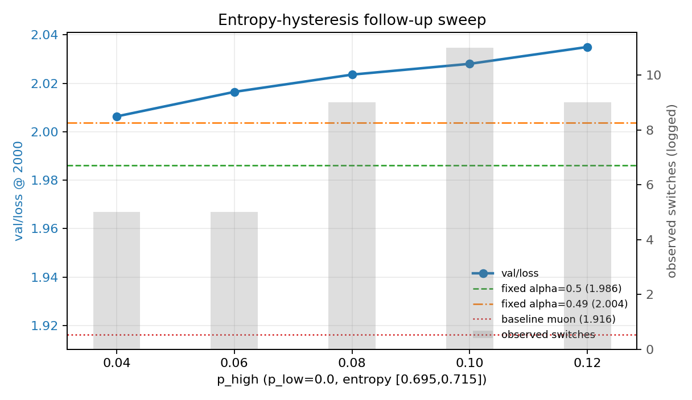
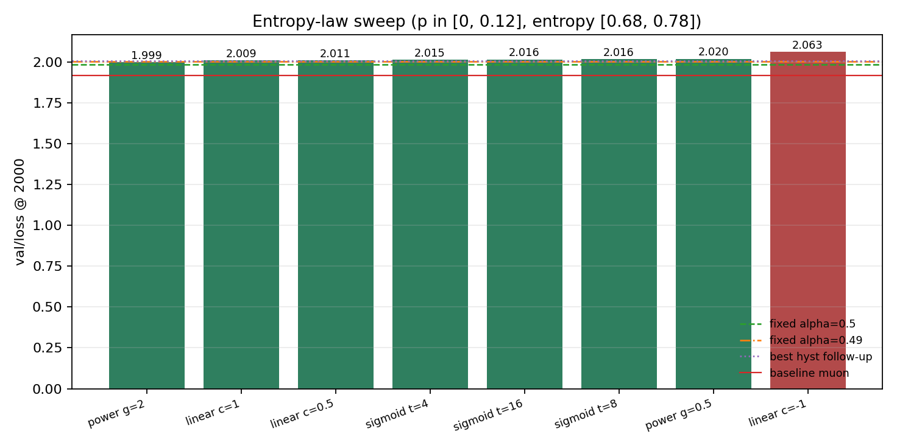
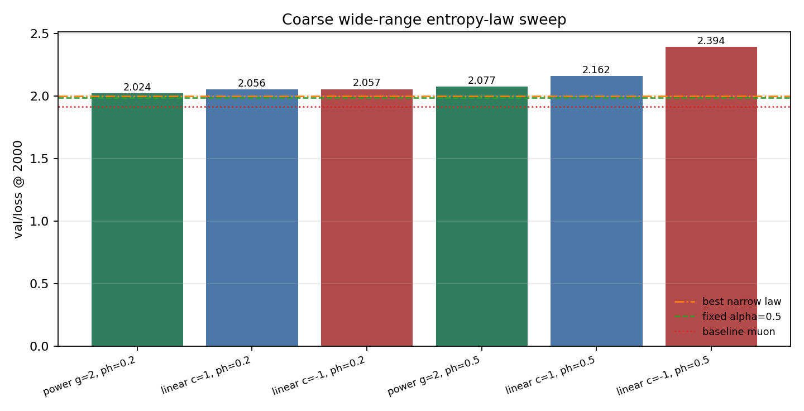
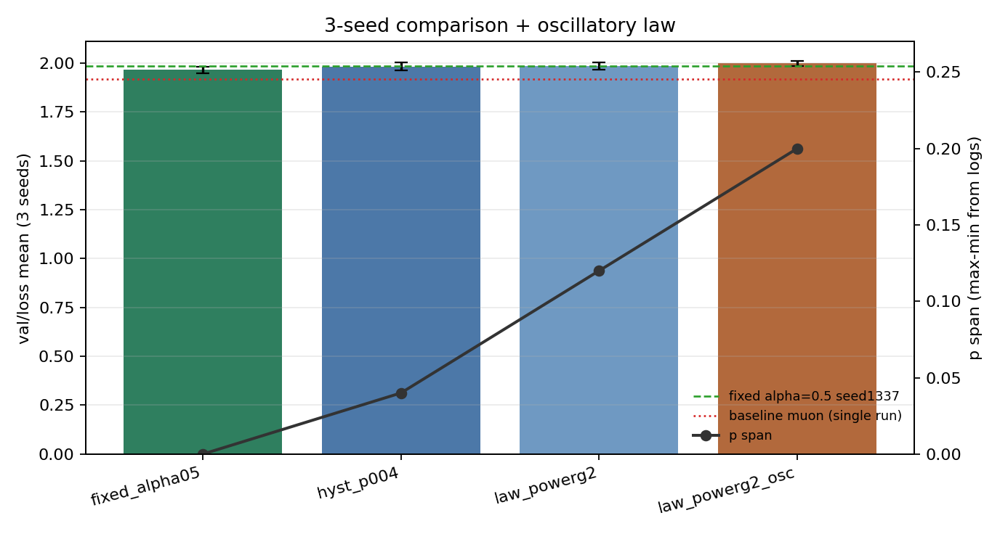
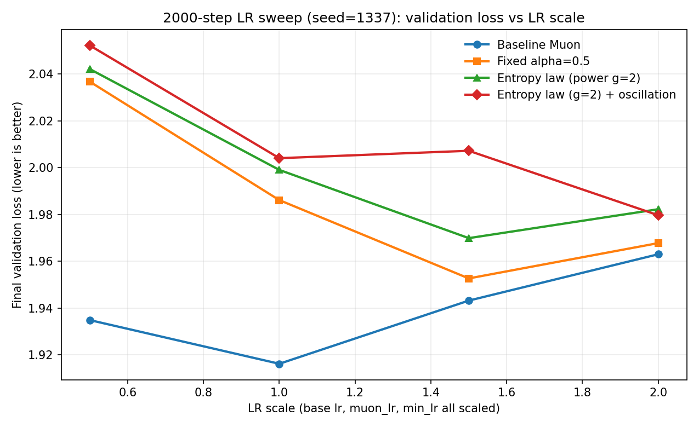
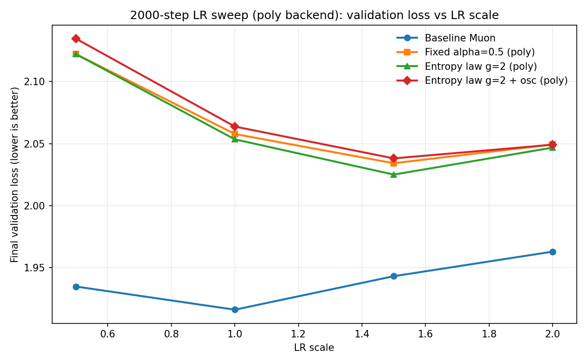

# Muon Schedule Lab

A clean experimental repo combining:

- [`Muongpt`](https://github.com/tomoqt/Muongpt) as the GPT training base
- scheduled singular-value power transforms from the `scheduled-muon` experiments

The core idea is to control update geometry with a singular-value exponent `p`.
Lower `p` is treated as more exploratory behavior. Higher `p` is treated as more exploitative behavior.

## Math in one place
Let a matrix update be `G = U S V^T`.

- Standard SGD keeps `p=1`: `G = U S^1 V^T`.
- Muon-like zeroth-power behavior corresponds to `p=0`: `U S^0 V^T`.
- General family: `G_p = U S^p V^T`.

Equivalent alpha form:

`G_alpha = G (G^T G)^(-alpha) = U S^(1-2alpha) V^T`, so `p = 1 - 2alpha`.

## What is implemented
Muon parameter groups can now run either:

- Newton-Schulz Muon update (original behavior), or
- singular-value-power update with scheduled exponent `p`.

For power updates, backend behavior is:

- `power_backend=poly` (default): polynomial approximation
- `power_backend=exact`: exact SVD (only when explicitly requested)

Supported schedules:

- `anneal`: linear annealing from `p_start` to `p_end`
- `anneal_cosine`: cosine annealing from `p_start` to `p_end`
- `fixed_alternating`: alternate between `p_low` and `p_high` every `power_alternation_period` steps
- `entropy_alternating`: switch between `p_low` and `p_high` using SVD-entropy hysteresis thresholds

Entropy-alternating uses gradient-matrix SVD entropy in `[0,1]`:

- switch to `p_high` when entropy rises above `power_entropy_high`
- switch to `p_low` when entropy falls below `power_entropy_low`

## Key files
- `train.py`: training loop and schedule integration
- `muon.py`: optimizer internals with optional power-SVD update
- `power_schedule.py`: schedule classes + entropy utilities
- `scripts/schedule_smoke.py`: small local smoke test on random data
- `scripts/run_schedule_suite.py`: reproducible baseline-vs-schedule suite runner

## Install
```bash
pip install -r requirements.txt
```

## Local smoke test (small)
This verifies all three schedule classes and optimizer integration without dataset prep:

```bash
python scripts/schedule_smoke.py
```

## Dataset prep (for real training)
Example small dataset:

```bash
python data/shakespeare_char/prepare.py
```

## Run training with schedules
Single-process example with Muon + annealing schedule:

```bash
python train.py \
  --dataset=shakespeare_char \
  --use_muon=True \
  --enable_power_schedules=True \
  --power_backend=poly \
  --power_schedule_type=anneal \
  --power_p_start=1.0 \
  --power_p_end=0.0 \
  --max_iters=200 \
  --batch_size=16 \
  --block_size=128 \
  --compile=False
```

Fixed alternating example:

```bash
python train.py \
  --dataset=shakespeare_char \
  --use_muon=True \
  --enable_power_schedules=True \
  --power_backend=poly \
  --power_schedule_type=fixed_alternating \
  --power_p_low=0.0 \
  --power_p_high=1.0 \
  --power_alternation_period=50 \
  --max_iters=200 \
  --batch_size=16 \
  --block_size=128 \
  --compile=False
```

Entropy alternating example:

```bash
python train.py \
  --dataset=shakespeare_char \
  --use_muon=True \
  --enable_power_schedules=True \
  --power_backend=poly \
  --power_schedule_type=entropy_alternating \
  --power_p_low=0.0 \
  --power_p_high=1.0 \
  --power_entropy_low=0.45 \
  --power_entropy_high=0.65 \
  --max_iters=200 \
  --batch_size=16 \
  --block_size=128 \
  --compile=False
```

Exact SVD is opt-in:

```bash
python train.py \
  --use_muon=True \
  --enable_power_schedules=True \
  --power_backend=exact
```

## Keep baseline in every comparison
Use the suite runner to always run baseline plus schedule variants under matched settings:

```bash
uv run --with-requirements requirements.txt \
  python scripts/run_schedule_suite.py \
  --max-iters 500 \
  --name-prefix long500
```

## Findings on shakespeare_char
Unless noted otherwise, all values are from 2000-step runs with
`config/train_shakespeare_char.py`, `n_layer=2`, `n_head=2`, `n_embd=64`.
The reference baseline run is:
- `long2000_baseline_muon`: `val=1.9162`, `train=1.7794`

### Fixed-alpha sweeps
Coarse sweep over `alpha in {-0.5, 0, 0.25, 0.5, 0.75, 1.0}`:
- Best was `alpha=0.5` (`p=0`), `val=1.9861`
- Moving far from `alpha=0.5` quickly degrades quality

Refinement below `0.5` (`alpha in {0.49, 0.48, 0.45, 0.40, 0.35, 0.30}`):
- Best was `alpha=0.49` (`p=0.02`), `val=2.0036`
- This stayed worse than the `alpha=0.5` run (`1.9861`)



### Entropy hysteresis sweeps
Initial hysteresis sweeps showed wide `p_high` ranges were unstable and high-loss.
Follow-up runs with tighter amplitude found:
- Best: `p_low=0.0`, `p_high=0.04`, thresholds `0.695/0.715`, `val=2.0063`
- Increasing `p_high` above `0.04` worsened validation in this setting




### Entropy-law sweeps
Across linear / power / sigmoid laws with `p in [0, 0.12]`, best run was:
- `power` law with `gamma=2`: `val=1.9990`

Coarser wide-range sweeps confirmed:
- Very large `p_high` values (for example `0.5`) and some inverse mappings hurt quality




### Repeatability check (3 seeds)
Mean and std over seeds `{1337,1338,1339}`:

| method | mean val | std |
|---|---:|---:|
| fixed_alpha05 | **1.9645** | 0.0154 |
| hyst_p004 | 1.9810 | 0.0203 |
| law_powerg2 | 1.9844 | 0.0200 |
| law_powerg2_osc | 1.9975 | 0.0114 |



### Exact backend (`power_backend=exact`)
| method | LRx0.5 | LRx1.0 | LRx1.5 | LRx2.0 | best |
|---|---:|---:|---:|---:|---:|
| baseline_muon | 1.9348 | **1.9162** | 1.9432 | 1.9630 | **1.9162 @1.0** |
| fixed_alpha05 | 2.0367 | 1.9861 | **1.9526** | 1.9677 | **1.9526 @1.5** |
| law_powerg2 | 2.0421 | 1.9990 | **1.9698** | 1.9822 | **1.9698 @1.5** |
| law_powerg2_osc | 2.0521 | 2.0040 | 2.0072 | **1.9796** | **1.9796 @2.0** |



### Poly backend (`power_backend=poly`, default)
| method | LRx0.5 | LRx1.0 | LRx1.5 | LRx2.0 | best |
|---|---:|---:|---:|---:|---:|
| baseline_muon | 1.9348 | **1.9162** | 1.9432 | 1.9630 | **1.9162 @1.0** |
| fixed_alpha05 | 2.1221 | 2.0577 | **2.0342** | 2.0494 | **2.0342 @1.5** |
| law_powerg2 | 2.1221 | 2.0534 | **2.0250** | 2.0467 | **2.0250 @1.5** |
| law_powerg2_osc | 2.1345 | 2.0637 | **2.0381** | 2.0491 | **2.0381 @1.5** |



### Practical read
Baseline Muon is still best across all LR scales in this setup.
Poly backend is faster than exact for scheduled runs, but currently loses validation quality
relative to exact by roughly `+0.06` to `+0.08` val loss on average across the tested methods.
Across the full set of char experiments, none of the scheduled variants beat baseline Muon on final validation.

## Notes
- Power schedule runs default to polynomial updates unless you set `power_backend=exact`.
- Entropy-based switching is intentionally simple and intended as an experimental baseline.
- This repo is meant to make schedule ablations easy to run and compare.
